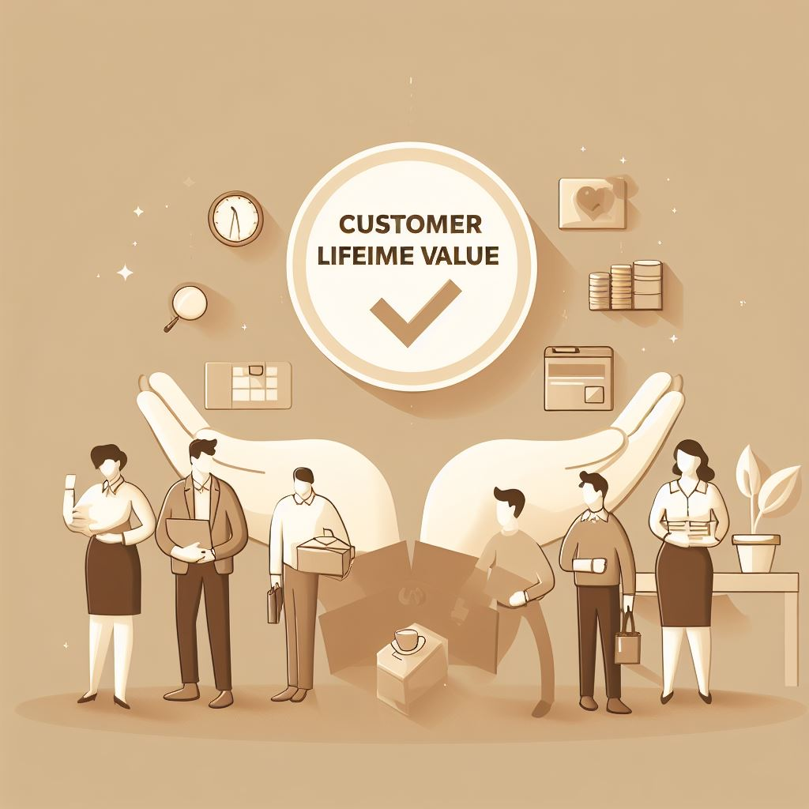

# 📊 Customer Lifetime Value (CLV) Analysis  

  

---

## 📌 Project Overview  
This project focuses on **Customer Lifetime Value (CLV) modeling** to analyze purchase behavior, loyalty patterns, and campaign response. By quantifying customer value, businesses can improve **retention, campaign ROI, and profitability**.  

---

## 🎯 Objectives  
- Explore customer behavior and loyalty data.  
- Model **Customer Lifetime Value** with regression techniques.  
- Provide **strategic recommendations** for revenue optimization.  

---

## 📂 Deliverables  
- 📄 [Project Report (PDF)](./deliverables/Customer_Lifetime_Value_Report.pdf)  
- 🎥 [Presentation (PPTX)](./deliverables/Customer_Lifetime_Value_Presentation.pptx)  
- 📑 [Jupyter Notebook (IPYNB)](./deliverables/Customer_Lifetime_Value_Analysis.ipynb)  
- 🌐 [HTML Report](./deliverables/Customer_Lifetime_Value_Analysis.html)  

---

## 📈 Key Insights  
- 📉 Revenue peaked in **2019**, dropped by **2023**.  
- 📊 Positive correlations: Purchases ↔ Revenue, Frequency ↔ Revenue.  
- ⚖️ Negative correlation: Purchases vs. Avg Purchase Value.  
- 🎯 Campaign success rate was only **5%** – personalization needed.  
- 🎟️ Loyalty cards improved retention but adoption was limited.  

---

## 🛠️ Tools & Technologies  
- **Python** – pandas, NumPy, scikit-learn  
- **Visualization** – matplotlib, seaborn  
- **Modeling** – RFM Features + Regression models  
- **Reports** – Jupyter Notebook, HTML, PowerPoint  

---

## ✅ Outcome  
- Identified **high-value customer segments**.  
- Improved campaign ROI with **targeting insights**.  
- Showcased how **CLV supports long-term strategy**.  

---

## 👥 Who Will Benefit  
- 🛒 **Marketing Teams** – Optimize campaigns.  
- 🤝 **CRM Managers** – Strengthen retention.  
- 💼 **Executives** – Forecast future revenue.  
